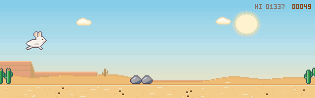
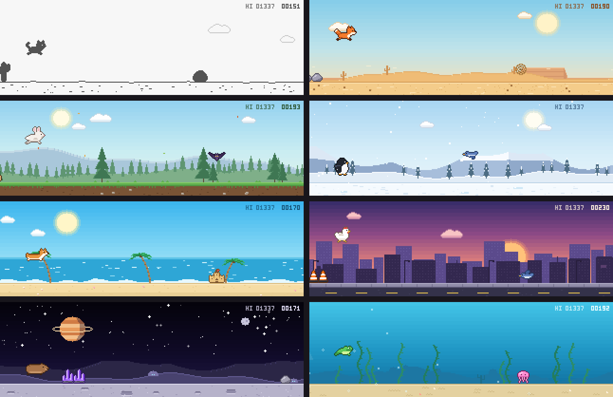
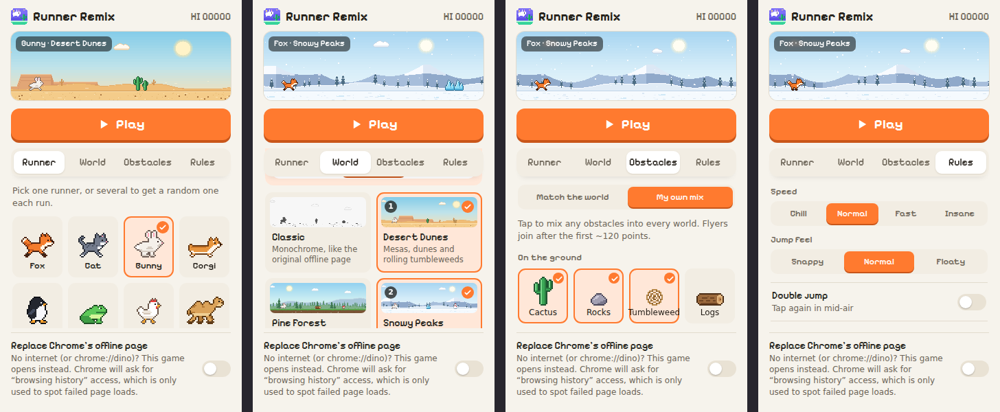
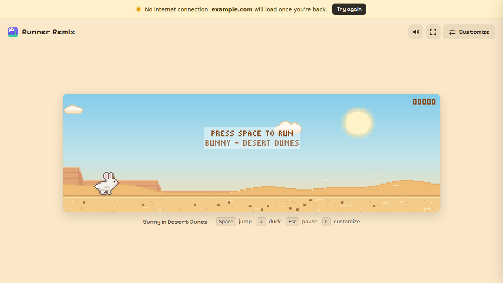

<p align="center">
  
</p>

<h1 align="center">Runner Remix</h1>

<p align="center">
  A remixable offline runner game for Chrome. Pick your animals, worlds and obstacles,<br>
  and optionally swap Chrome's “No internet” page for your own version.
</p>

<p align="center">
  
</p>

Runner Remix is a Chrome extension with an endless runner you can customize. Pick **runners** (animals), **worlds** and **obstacles**, set the rules, and play in a tab. You can also have it replace Chrome's offline page and `chrome://dino` with your version.

No build step and no dependencies: it's plain JavaScript modules and canvas. There's no tracking either. Settings stay in your browser (`chrome.storage.local`), and the extension makes no network requests.

## Features

- **9 runners**: fox, cat, bunny, corgi, penguin, frog, chicken, camel and capybara. You can also turn **any picture** into a pixel runner; photos get a round crop. Pick several and each run uses a random one.
- **8 worlds**: Classic (monochrome), Desert Dunes, Pine Forest, Snowy Peaks, Tropical Beach, Neon City, Moon Base (low gravity) and Coral Reef (floaty, underwater). Every world has parallax scenery and a day/night cycle. Pick several for a **World Tour** that switches world as you score.
- **19 obstacles**: each world brings its own set. Switch to *My own mix* to drop any obstacle into any world, UFOs in the desert included.
- **Rules**: speed (Chill → Insane), jump feel (Snappy / Normal / Floaty), double jump, Zen mode (no game over), day and night, and sound.
- **Fair by design**: obstacle spacing is computed from the current speed and jump physics. A bot using the exact physics ran 34 speed, world and jump combinations for 20k–30k frames each with zero crashes.
- **Offline takeover (optional)**: pages that fail with no internet, and `chrome://dino`, open the game instead. The tab goes back to the page once you're online.

<p align="center">
  
</p>

## Install

Runner Remix isn't on the Chrome Web Store yet, so you install it in Developer mode:

1. Download the `.zip` from the [latest release](https://github.com/theamiri/runner-remix/releases/latest) and unzip it. Keep the folder somewhere permanent, because Chrome loads the extension from it every time.
2. Open `chrome://extensions` and turn on **Developer mode** (top right).
3. Click **Load unpacked** and select the unzipped folder, the one with `manifest.json` inside.
4. Pin the bunny icon from the puzzle-piece menu. A welcome tab opens on install.

To update, replace the folder's files with the ones from the new release, then click the reload icon on the extension card in `chrome://extensions`. Keep the same folder and your settings and scores stay.

To work on the code, clone the repo and load the `runner-remix` folder the same way. Update with `git pull` and the reload icon.

```sh
git clone https://github.com/theamiri/runner-remix.git
```

## Playing

| Action | Keys |
|---|---|
| Jump (hold for higher) | `Space`, `↑`, `W`, click or tap |
| Duck / fast-fall | `↓`, `S`, swipe down |
| Pause | `Esc` or `P` |
| Customize panel | `C` |
| Sound / fullscreen | `M` / `F` |
| Open the game from anywhere | `Alt+Shift+R` (`Option+Shift+R` on Mac; change it at `chrome://extensions/shortcuts`) |

Click the toolbar icon for a live preview and the Customize panel. Changes are saved right away and sync to any open game tab.

<p align="center">
  
</p>

## Replacing Chrome's offline page

Chrome's built-in offline page (`chrome-error://chromewebdata/`) can't be scripted or restyled by any extension; Chrome blocks it. Instead, Runner Remix watches for page loads that fail with `net::ERR_INTERNET_DISCONNECTED` and swaps that tab for the game. `chrome://dino` goes through the same error internally, so it gets swapped too.

- It's **off by default**. Turn it on with the switch in the popup, or under Customize → Rules.
- It needs the optional `webNavigation` permission. Chrome's prompt calls this "Read your browsing history". The extension only uses it to spot failed loads; it stores nothing and sends nothing. Turning the switch off removes the permission.
- A banner shows which page failed and has a **Try again** button. When the connection comes back, the tab returns to the page on its own, unless you're mid-run.
- Pressing **Back** from the game shows Chrome's own offline page instead of looping.

<p align="center">
  
</p>

## Project layout

```
manifest.json      MV3 manifest (storage + optional webNavigation)
background.js      service worker: welcome tab, shortcut, offline takeover
popup.html/js/css  toolbar popup: live preview + customize + Play
game.html/js/css   game tab: canvas, Customize drawer, offline banner
ui.css             design tokens + the shared Customize panel styles
src/
  engine.js        game loop, physics, spawning, collisions, rendering
  world.js         turns world definitions into parallax tiles, draws sky/layers/ground
  sprites.js       ASCII pixel art → canvas + collision mask, outlines, tints
  customizer.js    the Customize panel (used by popup and drawer) + picture pixelator
  settings.js      settings schema, validation, storage
  registry.js      compiles animals/obstacles (cached)
  font.js          5px bitmap font for the in-game HUD
  audio.js         synthesized sound effects (no audio files)
  paint.js         helpers for painting scenery (waves, pines, palms, skylines…)
  data/animals.js    runner sprites (ASCII art)
  data/obstacles.js  obstacle + scenery sprites (ASCII art)
  data/worlds.js     world definitions and their painters
dev/preview.html   every sprite and world on one page, for contributors
docs/              README images
fonts/             Pixelify Sans (SIL Open Font License, see OFL-PixelifySans.txt)
```

The game world is 320×100 "art pixels", scaled up with nearest-neighbour so it stays crisp at any size.

## Make it yours

### Add a runner

Append an entry to `src/data/animals.js`. Each frame is ASCII art: `.` is transparent and every other letter is a key into `palette`. A 1px outline is added automatically, and `e` marks the eye, which turns into an X when you crash. You need two `run` frames, one `jump` frame and two `duck` frames. Keep standing frames about 20 rows tall at most and duck frames 10 rows or fewer, so flying obstacles line up with head height.

```js
{
  id: 'blob', name: 'Blob', outline: '#1d3b5c',
  palette: { b: '#5fb4ff', e: '#10233a' },
  run:  [[ '..bbbb..', '.bbbbeb.', 'bbbbbbbb', 'bbbbbbbb', '.b....b.' ],
         [ '..bbbb..', '.bbbbeb.', 'bbbbbbbb', 'bbbbbbbb', '..b..b..' ]],
  jump:  [ '..bbbb..', '.bbbbeb.', 'bbbbbbbb', 'bbbbbbbb', '........' ],
  duck: [[ '.bbbbbbeb.', 'bbbbbbbbbb', '.b......b.' ],
         [ '.bbbbbbeb.', 'bbbbbbbbbb', '..b....b..' ]],
},
```

### Add an obstacle or a world

- **Obstacle**: append to `OBSTACLES` in `src/data/obstacles.js`. Use `kind: 'ground'` or `'air'` with `lanes`. Optional fields: `cluster`, `vx`, `motion` (`bob` or `bounce`), `roll`, `anim` and `minScore`.
- **World**: append to `WORLDS` in `src/data/worlds.js`. A world has sky colour stops, parallax `layers` (painter functions that draw into a seamless 640px tile) and a `ground` painter. It also takes a night mode, ambient particles (`snow`, `bubbles`, `wind`, `leaves`, `fireflies`, `shooting`), `gravity`, and the obstacle ids to use.

New entries show up in the Customize panel automatically.

### Preview your sprites

ES modules don't load from `file://`, so serve the repo root and open the preview page:

```sh
python3 -m http.server 8000
# then open http://localhost:8000/dev/preview.html
```

It shows every runner frame, obstacle and world (day and night), with sizes, so you can check your art before reloading the extension.

## Contributing

Contributions are welcome: new runners, worlds and obstacles especially. Please:

- keep it dependency-free (plain ES modules, no build step)
- keep art original: no sprites or characters copied from other games or brands
- check your changes in Chrome with **Load unpacked** before opening a pull request

## Releases and the Chrome Web Store

Each [release](https://github.com/theamiri/runner-remix/releases) comes with a zip of just the extension files, with `manifest.json` at the root. To build one from a checkout, using the version from `manifest.json` in the file name:

```sh
git archive --format=zip -o runner-remix-1.0.0.zip HEAD \
  manifest.json background.js popup.html popup.js popup.css \
  game.html game.js game.css ui.css src icons fonts LICENSE
```

The same zip is what you upload to the Chrome Web Store Developer Dashboard, which needs a one-time developer registration. The listing also needs:

- 1280×800 screenshots
- a 440×280 small promo tile
- a short description
- a single-purpose statement
- a justification for `webNavigation`, which is used only to detect failed page loads for the optional offline takeover

Because `webNavigation` is optional, the install itself asks for no warnings. Avoid Google's names and trademarks in the listing title and art, such as "Chrome Dino", apart from saying it works with Chrome.

## License

[MIT](LICENSE) © 2026 Amiri Abdelghafour. The Pixelify Sans font is licensed under the [SIL Open Font License 1.1](fonts/OFL-PixelifySans.txt).
